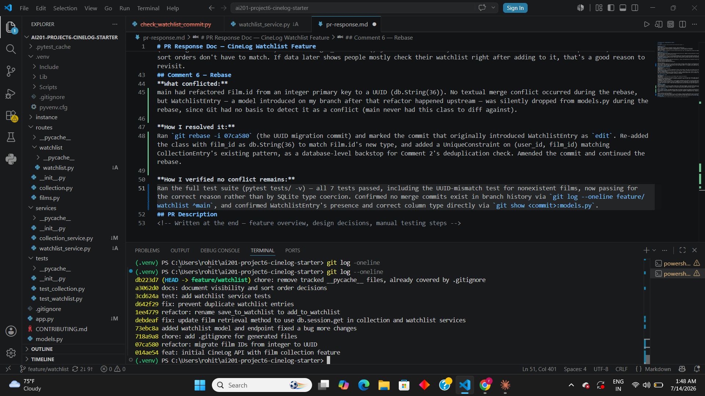

# PR Response Doc — CineLog Watchlist Feature

## AI Usage

Used AI as a debugging partner and devil's advocate, not a code author. It caught two syntax bugs in deduplication logic I wrote myself, helped trace where the rebase silently dropped WatchlistEntry, and stress-tested my sort-order position (Comment 5) by arguing the reviewer's side — I kept my position but incorporated the "no usage data" critique into my final reasoning. Also used it to check commit messages against conventional-commit format before finalizing the rebase.
## Comment 1 — Rename
**What I did:**
Services/watchliat_service.py contained a function: save_to_watchlist.py.
Function names should follow the project's naming convention - The pattern here is verb_to_noun.
Renames the function to Add_to_watchlist() and updated all call sites following this convention.
**How I verified:**
Used editor's find-all references to find the function def and call sites ,then updated and verified the changes.

## Comment 2 — Deduplication
**What I did:**
Following the deduplication pattern from services/collection_service.py i updated the add_to_watchlist() function to contain a deduplication feature preventing duplicate entries.
**How I verified:**
add_to_watchlist() now checks for an existing WatchlistEntry with the same user_id/film_id before inserting, raising AlreadyInWatchlistError if found — mirroring add_to_collection()'s pattern. Verified via pytest tests/test_watchlist.py::test_add_to_watchlist_duplicate_raises, which passed, confirming the second add raises the error and only one row exists
## Comment 3 — Missing test
**What I did:**
Followed the pattern existing in tests/test_collection.py , create a test_watchlist.py for watchlist service testing:
test_add_to_watchlist_creates_entry()
test_add_to_watchlist_duplicate_raises()
test_add_to_watchlist_nonexistent_film_raises()

**How I verified:**
Ran pytest tests/test_watchlist.py -v — all three tests passed. Initially, before rebasing, the nonexistent-film test passed for the wrong reason (SQLite's weak typing let a UUID-format string not match an integer Film.id column). After rebasing onto main and updating WatchlistEntry.film_id to a UUID type, reran the full suite (pytest tests/ -v — 7 passed) and confirmed this test now passes for the correct reason: a genuine UUID mismatch
## Comment 4 — Default visibility
**My position:** 
Keeping watchlistEntry.public=true
**Reasoning:**
Optimizes for discovery, it allows the opportunity to add a cosial feature. other users can see what you are planning to watch, This is often a feature of film-tracking app where users can see what their friends are planning to watch and watch it themselves.
**Tradeoff acknowledged:**
he cost is privacy: a watchlist can reveal things (genres, habits, timing) before a user's chosen to share them. Defaulting private avoids that, but the social feature would go mostly unused. I'm choosing discovery because that's core to CineLog's value — but users need to be told clearly the list is public by default, not buried in settings.

## Comment 5 — Sort order
**My position:**
Keep alphabetical (Film.title.asc()) as the default order funtion for watchlist.
**Reasoning:**
A watchlist and a collection serve different purposes. A collection is a historical log — recency makes sense there. A watchlist is a queue you check before deciding what to watch, so the main interaction is "what's on here" and "is X already queued" — a lookup task. Alphabetical order fits that better.
**Engagement with reviewer's point:**
The maintainer's point is fair — a batch of recently-added recommendations does benefit from being grouped together. I don't have usage data to prove one pattern dominates, so this is a judgment call, not a settled fact. I'd rather base that call on what a watchlist is for (scanning to decide what to watch) than match get_collection() just for consistency — the two features solve different problems, so their sort orders don't have to match. If data later shows people mostly check their watchlist right after adding to it, that's a good reason to revisit.
## Comment 6 — Rebase
**What conflicted:**
main had refactored Film.id from an integer primary key to a UUID (db.String(36)). No textual merge conflict occurred during the rebase, but WatchlistEntry — a model introduced on my branch after that refactor happened upstream — was silently dropped from models.py during the rebase, since Git had no basis to detect it as a conflict (main never had this class to diff against).

**How I resolved it:**
Ran `git rebase -i 07ca580` (the UUID migration commit) and marked the commit that originally introduced WatchlistEntry as `edit`. Re-added the class with film_id as db.String(36) to match Film.id's new type, and added a UniqueConstraint on (user_id, film_id) matching CollectionEntry's existing pattern, as a database-level backstop for Comment 2's deduplication check. Amended the commit and continued the rebase.

**How I verified no conflict remains:**
Ran the full test suite (pytest tests/ -v) — all 7 tests passed, including the UUID-mismatch test for nonexistent films, now passing for the correct reason rather than by SQLite type coercion. Confirmed no merge commits exist in branch history via `git log --oneline feature/watchlist ^main`, and confirmed WatchlistEntry's presence and correct column type directly via `git show <commit>:models.py`.

## PR Description
This PR adds a watchlist feature to CineLog, allowing users to save films they intend to watch later, separate from their collection of already-watched films.

Endpoints added:

GET /watchlist/<user_id> — returns all films on a user's watchlist
POST /watchlist/<user_id>/add — adds a film to a user's watchlist, given a film_id

Design decisions:

Default visibility: WatchlistEntry.public defaults to True. Watchlists are visible by default to support CineLog's social/discovery use case — seeing what friends are planning to watch. The tradeoff is user privacy; this is only appropriate if visibility is clearly communicated to users up front, not buried in settings. (See Comment 4 above for full reasoning.)
Sort order: get_watchlist() returns films sorted alphabetically by title (Film.title.asc()), rather than by date_added. This treats a watchlist as a lookup/browse task ("what's on here," "is X already queued") rather than a chronological log, unlike collections. This was raised as a disagreement with the reviewer and is documented in full in Comment 5 above, including engagement with the reviewer's counterpoint.

Manual testing steps:

Start the app: python app.py
Seed a user and film via a Python shell:

python   from app import create_app, db
   from models import User, Film
   app = create_app()
   with app.app_context():
       user = User(username="testuser", email="test@example.com")
       film = Film(title="Test Film", year=2020)
       db.session.add_all([user, film])
       db.session.commit()
       print(user.id, film.id)

Add the film to the watchlist:

   curl -X POST http://127.0.0.1:5000/watchlist/<user_id>/add -H "Content-Type: application/json" -d "{\"film_id\": \"<film_id>\"}"

Expect a 201 response with the new watchlist entry.
4. View the watchlist:

   curl http://127.0.0.1:5000/watchlist/<user_id>

Expect a list containing the film just added.
5. Attempt to add the same film again with the same request from step 3 — expect an error (AlreadyInWatchlistError), confirming deduplication.
6. Run the automated test suite: pytest tests/ -v — all 7 tests should pass.

